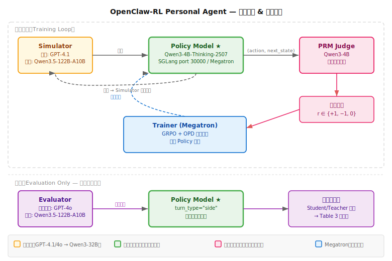
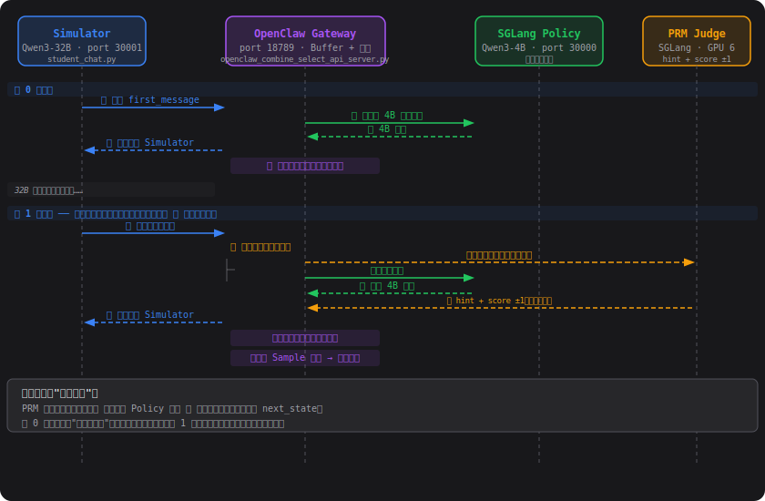

[← 工作记录](work_log.md)

# OpenClaw-RL 论文理解

> arXiv: 2603.10165 | 随时更新，记录复现过程中的新认知

## 一、核心问题

现有 agentic RL 系统忽略了一个普遍存在的训练信号：**next-state signal**（下一状态信号）。每次 agent 执行一个动作后，环境都会返回一个状态变化（用户回复、终端输出、GUI 变化、测试结果），这些信号既包含"做得好不好"的评估信息，也包含"应该怎么做"的指令信息，但没有现有系统系统性地利用它们。

---

## 二、两条训练路径

OpenClaw-RL 用同一套框架支撑两类 agent，训练路径并列独立（都从同一基础模型出发）：

| 路径 | 包含场景 | next-state 信号 | 训练信号 | 论文评估 |
|------|---------|----------------|---------|---------|
| **Personal Agent** | OpenClaw（个人设备对话）| 用户自然语言回复 / 工具调用结果 | binary reward ±1 + OPD | Table 3 |
| **General Agent** | Terminal / GUI / SWE / Tool-call | 执行环境反馈（stdout、屏幕状态、测试结果）| step-wise reward（turn PRM + outcome）+ standardization | Figure 5 |

两条路径实验独立，但底层框架相同。实际部署时是同一个模型服务，没有"切换 agent"——论文分开实验是为了干净评估各自信号的贡献。

---

## 三、系统架构：四个异步解耦的循环

```
Policy Server (SGLang)  ←→  Environment Server
        ↓ (aₜ, sₜ₊₁)              ↓
  PRM/Judge Server    →   Async Buffer ℬ
                                   ↓
                          Trainer (Megatron)
                          GRPO + OPD 混合损失
```

四个组件**完全异步**，互不阻塞：
- **Policy Server**：用 SGLang 对外提供推理 API，接收带 session ID 的请求
- **Environment Server**：对 Personal Agent 是用户/工具调用；对 General Agent 是 Terminal/GUI/SWE/Tool-call 四类执行环境
- **PRM/Judge Server**：对每个 `(aₜ, sₜ₊₁)` 对进行评分，提取评估信号和指令信号
- **Trainer**：用 Megatron 异步执行梯度更新，不干扰推理

**关键设计**：每个 HTTP 请求带 session ID，区分"主线 turn"（参与训练）和"side turn"（仅转发不训练）。

---

## 四、两类信号与训练目标

### 混合损失

$$\mathcal{L} = w_{RL} \cdot \mathcal{L}_{GRPO} + w_{OPD} \cdot \mathcal{L}_{OPD}$$

两者权重均为 1.0。

---

### 信号一：Evaluative Signal → GRPO

PRM Judge 对每个 turn 做 **m 次独立投票**（GUI 用 m=3，其余 m=1），输出标量奖励 `r ∈ {+1, −1, 0}`。

Step-wise 奖励整合公式（用于长 horizon 任务）：

$$r_t = o + \sum_{i=1}^{m} r_i / m$$

其中 `o` 是最终 outcome 奖励，`rᵢ` 是每个 turn 的 PRM 判分。

#### GRPO 实现：与标准 GRPO 的唯一差异

优化目标与标准 GRPO 完全相同（clipped surrogate，无 critic）：

```python
# slime/slime/utils/ppo_utils.py: compute_policy_loss()
ratio = exp(-ppo_kl)                          # ppo_kl = log π_old - log π_new
pg_loss1 = -ratio * advantages
pg_loss2 = -clip(ratio, 1-eps_lo, 1+eps_hi) * advantages
loss = max(pg_loss1, pg_loss2)
```

**唯一差异：Advantage 的计算方式——论文 Appendix A.1 原文：**

> *"Because each prompt has only one response in this real-time RL setting, **the GRPO advantage is set directly to the PRM reward.**"*

- 标准 GRPO：A_t = (r − group_mean) / group_std（需要 N>1 个 rollout 做组内比较）
- OpenClaw GRPO：**A_t^grpo = r_t ∈ {+1, −1, 0}**（直接等于 PRM 分数）

原因：Personal Agent 是 real-time 异步对话，每段历史只产生一条实际 response，不存在 N>1 的 rollout 组，无法做组内比较。PRM 的 ±1 直接承担了 baseline 的角色。

**超参数选择（非算法差异）：** KL 惩罚系数设为 0（`--use-kl-loss --kl-loss-coef 0.0`）。原版 GRPO 目标函数含显式 KL 项 −β·KL(π‖π_ref)，OpenClaw 将 β 设为 0，依赖 clip 本身约束更新幅度。

**完整计算路径（代码验证）：**

```
PRM score r_t ∈ {+1,-1,0}
   ↓  rollout.py: --disable-rewards-normalization → 跳过组内归一化，直接透传
   ↓  loss.py: get_grpo_returns(rewards, kl)
      → torch.ones_like(kl[i]) * rewards[i]   # 标量广播到 response 所有 token
   ↓  batch["advantages"] → rl_advantages → compute_policy_loss → grpo_pg_loss
```

**Hybrid 总损失**（代码 `openclaw_topk_select_loss.py` line 448）：

```python
loss = w_rl * grpo_pg_loss + w_opd * opd_loss   # w_rl = w_opd = 1.0
```

论文 Appendix A.4 写作 A_i^hybrid = w_OPD·A_i^OPD + w_RL·A_t^grpo（等价的数学形式，线性组合梯度 = 组合 advantage 进一个 loss）。

**设计动机**：Personal Agent 是 real-time 异步 RL，每个 prompt（某时刻的对话历史）只产生一条实际 response（对话不能重来），因此没有 N>1 的 rollout 组可以比较。PRM 的 ±1 二元判断承担了 GRPO 中"baseline"的角色——直接告知该 turn 是好还是坏，无需组内对比来估计相对价值。

---

### 信号二：Directive Signal → OPD（Hindsight-Guided On-Policy Distillation）

**Teacher 和 Student 是什么**

| 角色 | 模型 | 8 GPU 位置 | 输入 | 做什么 |
|------|------|-----------|------|--------|
| **Student**（π_old） | Qwen3-4B-Thinking-2507 | GPU 0-3（Megatron Actor，TP=4） | 原始状态 `s_t`，无 hint | 正在被训练的 policy；做 forward+backward，需要 4 卡是因为梯度+optimizer states 内存大 |
| **Teacher**（π_t） | Qwen3-4B-Thinking-2507（同一模型） | GPU 7（Megatron PRM Teacher，独立实例） | hint 拼接后的状态 `s_t^h` | 计算 teacher log-prob；只需 1 卡是因为无 optimizer states；**权重永远冻结** |

两者初始权重相同，差别在输入——teacher 多看了 hint（事后的纠正信息），能产出更"正确"的 token 分布，student 通过 OPD loss 向这个分布靠拢。

> **【已确认】Teacher 权重永远冻结，这是论文的设计选择，不是 bug。**
>
> 代码证据（`slime/slime/backends/megatron_utils/actor.py`）：
> - Teacher init：`args.no_load_optim = True`，初始化后直接 `clear_memory(); return`，没有 optimizer
> - `async_train()` 路由：`role == "prm_teacher"` 时调用 `compute_prm_teacher_log_probs()`，只做 **forward pass，没有 backward**
> - `actor_model.update_weights()` 只同步 actor→rollout engine，teacher 没有这步
>
> **"On-Policy" 的真正含义**：On-Policy 指的是 **teacher 处理的轨迹是 on-policy 的**（即当前 policy 刚生成的 rollout），而非 teacher 权重跟随 policy 更新。Teacher 每次接收的 rollout data 都来自最新 Student，所以它在不断变化的轨迹上给出 hint-conditioned log-prob。Student 进化后生成的轨迹也变了，Teacher 对这些新轨迹的反馈也随之变化——这就是 "on-policy" 的意义。Teacher 的角色是"固定的有提示的参考模型"，不需要随 Student 更新。

> **log-prob**：模型在每个生成位置对全词表每个 token 的预测概率取 log。OPD 用的不是"最可能的词"，而是完整的概率分布形状——teacher 与 student 在每个 token 上的 log-prob 差值 `Δᵥ` 就是 advantage 的来源。

**问题**：直接用 teacher（带 hint 的模型）蒸馏 student，会因分布偏移导致训练不稳定。

**解决方案：Overlap-Guided Hint Selection**

有 M 个候选 hint，选出最能与 student 分布"重叠"的那个：

$$S_i^g = \text{top-k}\{\pi_{old}(\cdot | s_t, y_{<i})\} \quad \text{(student support)}$$

$$S_{i,h}^p = \text{top-k}\{\pi_t(\cdot | s_t^h, y_{<i})\} \quad \text{(teacher support under hint h)}$$

$$h^* = \arg\max_h \sum_i |S_i^g \cap S_{i,h}^p|$$

选出 `h*` 后，在 student 的 support set `Sᵢ` 上计算 per-token OPD loss：

$$\mathcal{L}_i^{OPD} = \sum_{v \in S_i} \max(-A_v \rho_v, -A_v \cdot \text{clip}(\rho_v, 1-\varepsilon_{lo}, 1+\varepsilon_{hi}))$$

其中 advantage `Aᵥ = Δᵥ · wᵥ`，`Δᵥ` 是 log prob 差（做了 clip，防止极端梯度）。

**为什么来自同一回复的 m 个 hint 与学生分布的重叠会不同：**  
m=3 次 PRM 调用输入相同（同一回复 + 同一 next_state），但因 temperature>0 生成的 hint 文本各不相同（例如一个聚焦语气、一个聚焦格式、一个聚焦结构）。每个 hint 注入上下文后 teacher 模型产生的条件分布各异，与 student 当前分布的重叠自然不同。seq-optimal 选重叠最多的那个，确保 OPD 梯度落在双方都认为重要的 token 上，蒸馏最有效。

---

**三种方法的信号判别对比（Table 3 对应实现）：**

每个 turn（= policy 的一次回复）结束后，PRM 独立做两件事：
① 给出 RL 评分 ±1（`has_valid_rl`）
② 投票 m=3 次判断能否提取有效 hint（`opd_accepted`）

| 方法 | 每个 turn 做什么 | 失效时的处理 |
|------|----------------|------------|
| **GRPO** | 只做 ① RL 评分 | score=0 时 loss_mask=0（提交但不参与梯度）；session 无有效样本时强制保留一个（at-least-one 保证）|
| **OPD** | 只做 ② hint 提取 | 提取失败直接丢弃该 turn；无显式 session 级兜底 |
| **Hybrid RL** | ① ② 同时独立进行，结果组合决定路径 | 两者都失效才丢弃；`opd_accepted` 可在 GRPO 失效时独立托底（reward=0），但无 GRPO 的 at-least-one 保证 |

Hybrid RL 四条路径（来自 `openclaw_combine_api_server.py`）：

| `opd_accepted` | `has_valid_rl` | 提交路径 | 训练信号 |
|:-:|:-:|------|---------|
| ✅ | ✅ | `_submit_turn_sample(reward=RL分)` | GRPO + OPD |
| ✅ | ❌ | `_submit_turn_sample(reward=0.0)` | OPD only |
| ❌ | ✅ | `_submit_rl_turn_sample` | GRPO only |
| ❌ | ❌ | 丢弃 | — |

---

## 五、四类环境

| 环境 | 数据来源 | Next-state Signal | 并行度 |
|------|---------|------------------|-------|
| Terminal | SETA RL | stdout/stderr/exit code | 128 envs |
| GUI | OSWorld-Verified | 视觉状态差 + a11y tree | 64 envs |
| SWE | SWE-Bench-Verified | 测试结果/代码 diff | 64 envs |
| Tool-call | DAPO RL / Retool | API 返回值/错误 | 32 envs |
| Personal (OpenClaw) | GSM8K / 用户对话 | 用户回复/纠正 | — |

---

## 六、基础模型选择

| 组件 | 模型 | 说明 |
|------|------|------|
| Personal Agent Policy | Qwen3-4B-Thinking-2507 | **被训练的模型**，最终产出 |
| Terminal Agent | Qwen3-8B | — |
| GUI Agent | Qwen3VL-8B-Thinking（多模态）| — |
| SWE Agent | Qwen3-4B | — |
| Tool-call Agent | Qwen3-4B-SFT | — |
| PRM Judge | Qwen3-4B-Thinking-2507 | 与 policy 同一模型（Section 4.1）|
| Personal Agent Simulator | **Qwen3-32B** | Section 4.1 明确写明，扮演 student/TA/teacher |
| Evaluator（Table 3）| 无独立模型 | **Rule-based** session 计数，不调用 LLM |

> **注**：早期笔记曾误记 Evaluator 为 GPT-4o，Simulator 为 GPT-4.1，来源是 OEL 模块的 `gsm8k_personal_agent.py`（PR #96，论文提交后加入，与 Table 3 无关）。论文 Section 4.1 明确：Simulator = Qwen3-32B；Table 3 指标为 rule-based session 计数，无需 LLM。

---

## 七、各模型在训练流程中的角色

### 训练循环（Training Loop）



```
Simulator ──请求──▶ Policy Model ──(action, next_state)──▶ PRM Judge
    ▲                    ▲                                       │
    │                    │ 更新权重（梯度）                    奖励信号
    └──回复继续对话──────┤                                  r ∈ {+1,−1,0}
                         │                                       │
                    Trainer (Megatron) ◀─────────────────────────┘
                    GRPO + OPD 梯度更新
```

**Policy Model（Qwen3-4B-Thinking-2507）**

唯一被训练的模型，也是训练完成后实际部署使用的产出。训练前是普通助手，训练后学会了在不同用户风格（懒学生/严格老师）下调整回答方式。

**PRM Judge（Qwen3-4B）**

每次 Policy 回复一句话，PRM 就判断"这一步做得好不好"，给 +1/−1/0 分。这个分数通过 GRPO 计算 advantage，驱动 Megatron 更新 Policy 权重。**训练信号的核心来源，不替代。**

**Simulator（Qwen3-32B，Section 4.1）**

扮演"懒学生"或"挑剔老师"，不断给 Policy 发消息推动多轮对话。训练完成后直接丢弃，不出现在最终产品里。训练信号本身来自 PRM，不来自 Simulator 的质量。

**Evaluator（Table 3：rule-based，无独立模型）**

Table 3 指标是 rule-based session 计数——检查 Policy 回复是否满足预设规则（Student: 无 bold/编号列表/\boxed{}；TA: 回复 > 100 词；Teacher: 含暖词），达到连续 3 次满足则收敛，记录最少所需 session 数。不需要 LLM 打分。

### 评估阶段（Evaluation Only）

Table 3 用 `openclaw-test/student_chat.py`、`TA_chat.py`、`teacher_chat.py` 发起对话，再用 rule-based 脚本判断 Policy 回复是否收敛（不调用 LLM）：

```
student_chat.py ──测试请求──▶ Policy Model（turn_type="side"，不产生训练数据）
                                    │
                          Policy 回复
                                    │
                    rule-based 判断（Student/TA/Teacher 规则）
                    连续 3 次满足 → 记录 session 数（Table 3 指标）
```

---

## 八、Personal Agent 三角色的适应类型

三个 Persona 不是随机选择的，它们代表了**三种本质不同的偏好适应类型**，覆盖了 LLM 个性化调整中所有可能的梯度方向，从而使 Table 3 的平均分能反映通用个性化能力，而非某一类任务的选择性报告。

| Persona | 适应类型 | 名称含义 | 具体要求 | Joint 收敛 |
|---------|---------|---------|---------|:---:|
| **Student** | **Suppress（抑制）** | 让模型**停止**做它已学会的默认行为 | 不得含 bold / 编号列表 / `\boxed{}` | 11.6 |
| **TA** | **Amplify（放大）** | 让模型**做更多**它本来就在做的事 | 回复 > 100 词 | 8.2 |
| **Teacher** | **Add（新增）** | 让模型**插入**它默认不会生成的特定内容 | 包含 "well done" / "excellent" / "great job" | 11.4 |

**为什么是这三个名称：**

- **Suppress（抑制）**：LLM 经过 SFT 后天然倾向于使用 markdown formatting（bold、编号、`\boxed{}`），因为 formatting 被认为是"更有帮助的助手"的标志。Student 要求的正是压制这个已固化的习惯，梯度方向与预训练偏好相反，是三者中阻力最大的，收敛最慢（11.6）。

- **Amplify（放大）**：LLM 本来就会输出文字，TA 只要求输出得更多（超过 100 词）。梯度方向与 LLM 已有的输出倾向一致，没有需要克服的反向习惯，阻力最小，收敛最快（8.2）。

- **Add（新增）**：Teacher 要求加入特定暖词，这些词不在 LLM 的默认输出里，但也不是需要主动压制的东西——模型只需要学会在回复末尾植入新的触发模式。既不是逆向抑制也不是同向放大，是中等难度的新行为习得（11.4）。

**为什么三者组合才能衡量通用个性化能力：**  
若某方法只擅长"放大"（Amplify）而不擅长"抑制"（Suppress），三个平均会如实反映出来。三种适应类型的覆盖确保了平均分不会因为角色选择的偏向而失真——这也是为什么 Table 3 以平均分作为主结果数字的设计理由。

---

## 九、Simulator 部署方案（待定）

论文 Simulator 为 **Qwen3-32B**（Section 4.1）。有两条路径：

| 路径 | 说明 | 差异 |
|------|------|------|
| **方案 A：直接部署 Qwen3-32B** | 完全忠实论文，TP=4 on 4×H20 | 零偏差 |
| **方案 B：Qwen3.5-122B-A10B 替代** | 本地正在下载，MoE 仅 10B active，TP=2 on 2×H20 | 对话风格略有差异，训练信号（PRM）不变 |

**决策（已确认）：** 使用 **Qwen3-32B**（论文原版，方案 A），Qwen3.5-122B 作为后续优化备用，不影响当前复现。

**注**：Evaluator 已确认为 rule-based session 计数，不需要任何 LLM 模型。

---

## 十、GPU 布局与组件映射

论文 Personal Agent 训练使用 8 GPU，四个组件各自占用独立 GPU：

| 组件（实现层）| 对应概念层 | GPU 数 | 说明 |
|-------------|----------|--------|------|
| Actor (Megatron) | **Trainer** | 4 | 训练核心。计算 ref log-probs（ratio 基准）和 old_actor log-probs（GRPO ratio + OPD 输入），执行 backward + optimizer 更新，将最新权重同步给 Rollout。需 4 卡：4B 模型 + 梯度 + optimizer states 内存大 |
| Rollout (SGLang) | **Policy Server** | 2 | 推理引擎。接收 Simulator 请求，生成 policy 回复 token。topk-select 模式下只输出 token，不输出 log-probs——log-probs 全由 Actor Megatron 重算以保证精度 |
| PRM Judge (SGLang) | **PRM/Judge Server**（打分+hint）| 1 | 双职能评判。同一次 LLM 调用既输出 `\boxed{±1}` 评分（→ GRPO reward）又提取 `[HINT_START]...[HINT_END]` hint 候选，调用 m=3 次后选出最优 h* |
| PRM Teacher (Megatron) | **PRM/Judge Server**（蒸馏）| 1 | 冻结的参考模型。以 hint 增强状态 s_t^h 为输入，只做 prefill（无生成），输出 teacher log-probs 供 OPD loss 计算蒸馏梯度。用 Megatron 而非 SGLang 是因为需要全精度全词表 log-probs |
| Qwen3-32B Simulator | **Environment Server** | 外部服务 | 用 Qwen3-32B 模拟三种用户 persona（Student / TA / Teacher），对每次 policy 回复生成自然语言 next-state signal。不参与梯度更新，独立于 8 张训练 GPU 之外 |
| **合计** | | **8** | |

> **概念层与实现层的差异**：Section 2 的 4 个异步组件中，Environment Server 在实现上是外部 Simulator（不占训练 GPU）；PRM/Judge Server 在实现上拆成了两个 GPU 组件（Judge 负责打分+生成 hint，Teacher 负责蒸馏 log-probs）。

**两个 PRM 组件的分工**：

- **PRM SGLang（GPU 6）**：负责"**应该给什么 hint**"——`_query_judge_once()` 一次 generation 同时产出评估分（`\boxed{±1}`）和 hint 文本（`[HINT_START]...[HINT_END]`），调用 m 次后由 `_select_best_hint()` 选出最优 h*。打分和生成 hint 是同一次 LLM 调用，不是两步。
- **PRM Teacher（GPU 7）**：负责"**给了这个 hint 之后 teacher 分布长什么样**"——拿到 h* 后只做 prefill（`max_new_tokens=0`），输出 teacher log-probs 供 OPD loss 计算蒸馏梯度。权重与 SGLang PRM 相同但是独立 Megatron 实例，精度更高且支持全局 log-prob（SGLang 精度不足，代码有明确 assert）。

---

## 十一、OpenClaw 调用架构：32B Simulator 如何与 4B Policy 交互

### OpenClaw 职责一览（Personal Agent track 专用，仅用于 Personal Agent，General Agent 不使用）

**注意：下表混合了两个不同层次的组件，都被论文/代码统称为"OpenClaw"，但实际是两个进程：**

| 层次 | 组件 | 端口 & 转发关系 | 职责 |
|---|---|-------------------------------------|-----------------------------------------------------------------------------------------------------------------------------------|
| Agent 运行时 | `openclaw gateway run`（真实产品） | 18789，出站 LLM 请求转发给 30000 | 给 Policy(4B) 提供实际的文件读写等工具能力：解析模型的工具调用请求、真正执行文件系统操作（对应论文原文"use OpenClaw to conduct their work"、产出 `homework1`/`homework2` 目录，见本文档第十三节引用）、把执行结果喂回模型下一轮对话 |
| RL 数据管道 | `openclaw_combine_select_api_server.py`（官方仓库自建代理） | 30000，内部再转发给真正的 SGLang 引擎 | 本身不执行任何工具调用，只负责下表列出的路由/buffering/PRM 打分/样本组装职责 |

RL 数据管道层的具体职责：

| 职责 | 说明 |
|------|------|
| **消息路由 & turn_type 分流** | 转发请求给 Policy(4B)，根据 `turn_type` 决定走完整数据采集（main）还是只转发不记录（side） |
| **会话历史管理 & 并发隔离** | 维护每个 session 的完整对话上下文，多 session（student/TA/teacher）之间按 session_id 互相隔离 |
| **延迟缓存（buffering trick）** | 暂存本轮数据，等下一条消息到达后作为 next_state，才能触发上一轮的 PRM 打分 |
| **PRM 评估 & hint 候选筛选** | 并发调用 PRM Judge m=3 次，获取 hint 候选 + ±1 二元奖励；筛选通过的 hint（去重、最短优先，保留最多 K 个） |
| **三路分发** | 根据 hint 是否通过、RL 分数是否有效，将轮次分为 OPD+RL / OPD-only / RL-only / 丢弃四种情况 |
| **Sample 组装 & 提交训练** | 将 (prompt, response, teacher_tokens_candidates, reward) 打包成 Sample，推入训练队列供 Megatron 消费 |
| **训练门控** | weight update 期间暂停接收新请求，更新完成后恢复 |

**为什么两层都要跑（复现时的实现决策，见 [`implementation_path.md`](implementation_path.md) 三端口架构）：** 只跑 RL 数据管道层拿不到真实的 agent 工具调用行为（论文设计的核心场景之一，比如作业文件读写），必须让真正的 `openclaw gateway run` 在前面接住 Simulator 的请求、执行真实工具调用后，再把它自己的出站 LLM 请求转发给 RL 数据管道层去做训练数据采集。

### 组件关系（谁调用谁）

```
student_chat.py
  │
  ├─① generate_student_message()
  │    调用 Qwen3-32B（port 30001）生成下一条学生消息
  │
  └─② send_to_openclaw()
       POST port 18789（真正的 openclaw gateway run，执行工具调用/维护对话历史）
                │
             └─ 出站 LLM 请求转发给 port 30000（`openclaw_combine_select_api_server.py`）
                          │
                       ├─ 转发给真正的 SGLang 引擎生成 Qwen3-4B Policy 回复
                          │
                       ├─ buffer 本轮 turn_data（等下一轮消息作为 next_state）
                          │
                       └─ 下一轮消息到达时，异步 fire_opd_task → PRM Judge（port X）
                            └─ hint + score ±1 → 组装 Sample → 训练队列（Megatron）
```

### 两轮对话的完整时序（含 buffering trick）



```
          Simulator(32B)     Gateway(18789)    Policy(4B)    PRM Judge
               │                    │                │             │
─ TURN 0───────│────────────────────│────────────────│─────────────│
               │──① first_msg─────>│                │              │
               │                   │───② 转发──────>│              │
               │                   │<──③ 回复───────│              │
               │<──④ 回复──────────│                │              │
               │                   │ [暂存本轮数据]   │              │
               │                   │                │              │
  32B生成下一条消息                  │                │              │
               │                   │                │              │
─ TURN 1───────│────────────────────│────────────────│─────────────│
               │──① next_msg──────>│                │              │
  Turn1消息=上一轮的next_state      │ ② 同时发出：
               │                   │═══② 对上一轮回复打分（异步）════>│
               │                   │──② 转发 4B 生成本轮回复──>│     │
               │                   │<──③ 4B 回复────│               │
               │                   │<═══════ ③ hint+score（异步）════│
               │<──④ 回复──────────│ [暂存本轮数据]  │               │
               │                   │ [上一轮 Sample 提交 → 训练]     │
               │                   …                …              …
```

**关键**：② 和 ③ 同时发出（并行）——PRM 评分 T=0 不阻塞 4B 推理 T=1，Simulator 感受不到延迟。

### 三个关键设计

**1. session ID 维持对话上下文**

`send_to_openclaw()` 每次发的是**单条 user 消息**（不是完整 history），但附带 `user="student-hw-0-<pid>"`：

```python
json={
    "model": "default",
    "user": session_user,           # ← session 标识
    "messages": [{"role": "user", "content": message}]   # ← 只有当前消息
}
```

OpenClaw gateway 用 `session_user` 作 key 维护完整对话历史，每次请求都把历史拼回去再转发给 SGLang Policy。Simulator 侧不维护对 Policy 的完整对话——只维护自己的"学生视角"的 `conversation_history`（用于让 32B 生成下一句）。

**2. 延迟一拍的 OPD 评分（buffering trick）**

OPD 需要 `(response_t, next_state_{t+1})` 一对才能打分，但 next_state 在 turn T+1 才到达。因此：

- Turn T 请求到达时：
  1. 把 turn T 的 `(prompt, response, logprobs)` 写入 `_pending_turn_data[T]`
  2. 用 turn T 的消息作为 turn T−1 的 next_state，fire 对 T−1 的 OPD 评分 `_fire_opd_task(T-1, next_state=turn_T.msg)`
  3. 立刻转发 turn T 给 SGLang 生成回复，**不等打分**

这个"延迟一拍"设计让 PRM 评分与对话推理**完全并行**，不影响响应延迟。

**3. 四类 turn 类型决定是否产生训练数据**

每个请求可携带 `turn_type` 字段（OpenClaw 内部路由用）：

| `turn_type` | 说明 | 是否产生 Sample |
|-------------|------|:-:|
| `"main"` | Simulator 发来的正式对话轮 | ✅ 写入 pending，等 next_state 后提交 |
| `"side"` | 评估阶段的测试请求 | ❌ 只转发，不录数据 |

训练阶段的请求全部是 `"main"`；`openclaw-test/` 里的评估脚本发的是 `"side"`，这保证了评估不污染训练队列。

### 端口分工汇总

**更正（2026-07-10）：** 此前把 18789 和 30000 的进程归属弄反了，已用官方源码核实修正——`openclaw-test/README.md` 明确 `OPENCLAW_GATEWAY_URL` 默认 `localhost:18789`，配套 `OPENCLAW_WORKSPACE`（workspace 目录只有真正的 `openclaw gateway run` 才用得到）；`run_qwen3_4b_openclaw_topk_select.sh` 里 `openclaw_combine_select_api_server.py` 自己 `export PORT="30000"`。18789 上跑的是真正的 `openclaw gateway run`，不是官方仓库这个 Python 训练数据代理。

| 端口 | 进程 | 调用方 |
|------|------|--------|
| **30001** | Qwen3-32B（Simulator）推理 | `student_chat.py` 的 `generate_student_message()` |
| **18789** | 真正的 `openclaw gateway run`（真实产品，含 workspace 文件工具）| `student_chat.py` 的 `send_to_openclaw()` |
| **30000** | `openclaw_combine_select_api_server.py`（官方 RL 训练数据代理，内部再转发给真正的 SGLang 引擎做 Qwen3-4B rollout）| 真正的 `openclaw gateway run` 的出站 LLM 请求（对应 `models.providers.sglang` 配置） |
| **PRM URL** | SGLang PRM Judge（GPU 6）| `openclaw_combine_select_api_server.py` 内部的 `_query_judge_once()` |

---

## 十二、关键超参数

| 参数 | Personal Agent | General Agent |
|------|---------------|---------------|
| 学习率 | 1e-5 | 1e-6 |
| w_RL / w_OPD | 1.0 / 1.0 | 1.0 / 1.0 |
| OPD clip C | 1 | 2 |
| Top-k 宽度 K | 4 | 4 |
| hint 数 m（per turn）| 3 | 3（GUI），1（其余）|
| hint 选择方式 | sequence_optimal | sequence_optimal |
| OPD subset S_i | student top-K | student top-K |
| PPO clip (εlo / εhi) | 0.2 / 0.28 | 0.2 / 0.28 |
| KL 系数 β | 0.0（关闭）| 0.01 |
| rollout temperature | 0.6 | 0.6 |
| 每 prompt 采样数 N | 1 | 8 |
| rollout batch size | 16 | 8（GUI/SWE）/ 16（Terminal）/ 32（Tool-call）|
| 最大响应长度 | 8192 tokens | 8192 tokens |
| rollout 上下文长度 | 32768 tokens | 16384 tokens |
| max tokens per GPU | 32768（动态 batching）| — |

---

## 十三、Megatron Actor 的训练参数细节

从官方 `run_qwen3_4b_openclaw_topk_select.sh` 提取的关键参数：

```bash
# 性能/并行
--tensor-model-parallel-size 4   # Actor TP=4
--sequence-parallel               # 对应 TP 开启序列并行
--pipeline-model-parallel-size 1  # 无流水线并行
--recompute-granularity full      # 完整 gradient checkpointing（省显存）
--recompute-method uniform
--recompute-num-layers 1

# 动态 batching
--use-dynamic-batch-size
--max-tokens-per-gpu 32768        # 每张 GPU 最多 32K tokens/step

# Rollout
--rollout-batch-size 16           # 收集 16 个 session turn 后触发一次训练
--n-samples-per-prompt 1          # 每个 prompt 一条轨迹（不是 GRPO 的 k samples）
--rollout-max-response-len 8192
--rollout-max-context-len 32768
--rollout-temperature 0.6
--num-steps-per-rollout 1

# Optimizer
--optimizer adam
--lr 1e-5
--optimizer-cpu-offload           # Adam 状态卸载到 CPU（对小 GPU 内存很重要）
--overlap-cpu-optimizer-d2h-h2d   # overlap D2H/H2D 传输
--use-precision-aware-optimizer
```

---

## 十四、其他重要实现细节

### 1. OPD 使用全局 log-prob，不是 subset 归一化

代码注释里明确解释了为什么用 **GLOBAL ratio** 而不是 subset 内归一化：

> 如果用 subset 内归一化的 ratio，student 可以通过把 subset 外的质量压到接近零来"满足"约束，而不真正学习 teacher 的分布。用全局 ratio 才能让 IS 校正是诚实的。

```python
# ell_cur = raw_logits(v) - global_lse(raw_logits)  ← 全局 log-prob，有 autograd
# rho_v = exp(ell_cur - ell_old)                    ← 全局 ratio
```

实现上用了两个自定义 autograd Function：
- `_VocabParallelGatherRawLogits`：在 TP 分片的词表上 gather 指定 vocab id 的 raw logits
- `_VocabParallelGlobalLSE`：跨 TP 分片计算全局 log-sum-exp

**代价：** backward 时需要 materialize `[R, V_local]` 的全局 softmax，显存开销不可避免。

---

### 2. hint_opd_loss 和 openclaw_topk_select_loss 的默认权重不同

| 模块 | w_rl 默认值 | w_opd 默认值 | 含义 |
|------|-----------|------------|------|
| `hint_opd_loss.py` | **0.0** | 1.0 | 纯 OPD，无 GRPO |
| `openclaw_topk_select_loss.py` | **1.0** | 1.0 | GRPO + OPD 混合 |

论文的完整方法是 `openclaw_topk_select_loss`（w_rl=1.0, w_opd=1.0）。

---

### 3. 训练与提交的解耦机制

`openclaw_rollout.py` 里有一个关键的 **pause/resume 机制**：

```python
worker.resume_submission()   # 开放样本提交
completed_samples = drain_output_queue(...)  # 等待收集足够样本
worker.pause_submission()    # 暂停提交 + 清空 record 文件
# → 触发 Megatron 梯度更新
```

训练时 submission 被 **暂停**，防止训练期间的请求产生用旧权重生成的样本混入下一轮。这是论文里"异步但不污染"的核心保证。

---

### 4. Joint 训练的 Workspace 文件机制（已由论文 + 代码双重确认）

**结论：homework1/ 和 homework2/ 在 Joint 训练期间是固定不变的。**

论文 Appendix A.1（p.21）原文：
> "The TA setting **can only be evaluated after the student setting has been completed**. Similarly, the teacher setting **can only be evaluated after the TA setting has been completed**. In the joint optimization setting, **we first save the directory completed by the student as `homework1`, and save the directory completed by the TA as `homework2`**. We then start joint optimization, where the three simulated users use OpenClaw to conduct their work simultaneously."

**完整流程：**

1. **初始化阶段（顺序，一次性）**：Student 跑完全部 72 题 → `homework/` 完整 → TA 跑完全部 72 题 → `homework1/` 完整 → Teacher 跑完 → `homework2/` 完整
2. **Joint 训练阶段（并行，持续）**：三个 Simulator 同时向 Policy 发请求；homework1/ 和 homework2/ 内容固定，不随 Student/TA 当前轮次输出更新

**为什么合理**：三个 Simulator 训练的是 Policy 的**沟通风格**（Student：无 markdown；TA：回复 > 100 词；Teacher：含暖词），不需要动态刷新 homework 内容——固定任务背景足以产生 on-policy 训练信号。

---

### 5. old_log_probs 来源必须是 Megatron，不能用 SGLang rollout

代码里有明确的 assert：

```python
assert not getattr(args, "use_rollout_logprobs", False), (
    "hint_opd loss requires old-policy log-probs from Megatron old_actor, not SGLang rollout"
)
```

原因：SGLang rollout 输出的 log-prob 精度不够，OPD 需要精确的全局 log-prob 来计算 IS weight 和 advantage。

---

### 6. rollout_batch_size 决定每轮训练等待的样本数

`_drain_output_queue` 里等待 `args.rollout_batch_size` 个 group 才触发训练。
启动脚本里设置的是 `--rollout-batch-size 16`，即每收集 16 个 session turn 才更新一次参数。

等待超过 30 秒没有新样本时会打印进度日志，可以用来判断 pipeline 是否卡住。

## 十五、复现难点

1. **仓库边界识别**：官方仓库包含多个论文提交后加入的无关模块（OEL、Fireworks、Tinker），需要提前区分清楚，才能沿正确路径复现
2. **异步基础设施**：四个组件完全解耦，需要实现可靠的 session 级消息路由和 buffer 同步机制
3. **Hybrid 信号融合**：GRPO（binary reward）和 OPD（token-level distillation）是两套机制完全不同的信号，需要同时正确实现并协调组合
4. **Overlap-Guided OPD**：per-token 级别的 teacher/student 词表 top-k 交集计算，计算量敏感
5. **PRM Judge**：需要针对每类环境设计不同的 prompt 模板来提取评估/指令信号
6. **Megatron 集成**：论文用修改版 Megatron-Core 做分布式训练，与 SGLang 的权重同步和 log-prob 精度对齐需要仔细设计
7. **Personal vs General 实现差异**：两条路径的 GRPO advantage 计算不同（Personal: N=1 直接用 PRM score；General: N=8 组内归一化），由同一代码路径通过参数区分，容易混淆
8. **环境多样性**：四类环境的 next-state signal 格式完全不同，需要统一抽象
9. **General Agent 云环境规模**：128 / 64 / 32 个并行环境的部署规模远超单机，需要云端基础设施支持

---

## 十六、复现进度备注

> 此节随项目推进持续更新

- [ ] 项目骨架搭建
- [ ] Async Buffer 实现
- [ ] Environment 抽象层（Terminal → GUI → SWE → Tool-call）
- [ ] PRM Judge Server
- [ ] Policy Server (SGLang)
- [ ] OPD loss 实现
- [ ] GRPO loss 实现
- [ ] Trainer (Megatron) 集成
- [ ] 端到端联调
- [ ] 实验评估
